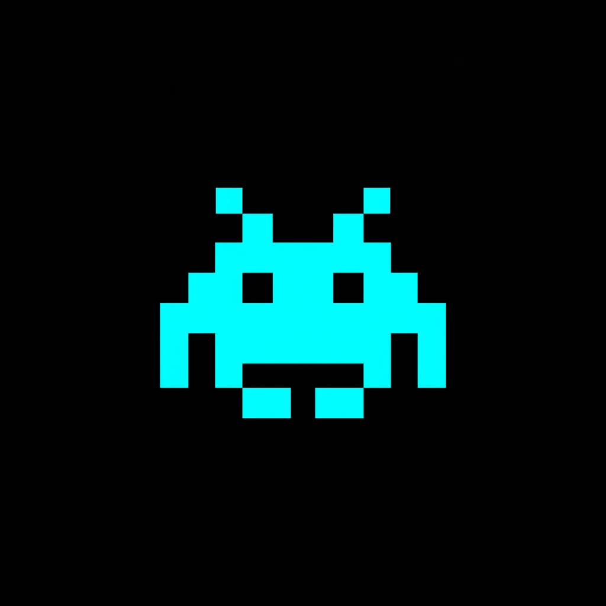
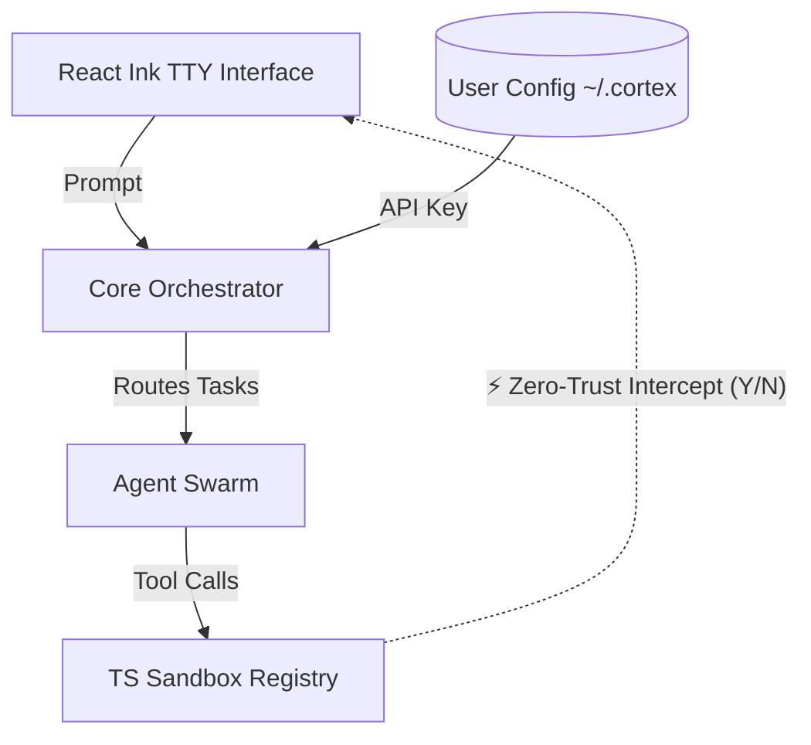

<div align="center">



# ⚡ CORTEX System v3.0

**Enterprise-Grade Multi-Agent OS & Shell**

</div>

---

## 📖 Overview
CORTEX is a high-performance, fully localized, and absolute Zero-Trust Multi-Agent Operating System installed natively inside your Windows Command Terminal via Node.js and TypeScript. 

Built to replace complex software engineering pipelines, CORTEX features an incredibly lightweight React Ink interface capable of rendering multiple AI agent outputs linearly at 0% latency using asynchronous TS generators. 

---

## 🚀 Key Enterprise Features

### 1. Global Operating Execution (`npm link`)
CORTEX is a globally-linked binary. Type `cortex` in any new terminal, and the OS will instantly boot, commandeering that specific directory as its active workspace, regardless of where that directory lives on your host machine.

### 2. Universal Proxy Architecture (Model Agnostic)
Escape vendor lock-in. CORTEX uses native JSON Schema arrays mapped uniquely to Universal OpenAI proxies. Plug your `OPENAI_BASE_URL` into any proxy:
* **Local Operations**: LM Studio, Ollama, vLLM
* **Cloud Infrastructure**: Groq, LiteLLM
* **Frontier Models**: LLaMa 3 (70b), Gemini 1.5 Pro, Claude 3.5 Sonnet

### 3. "Human-In-The-Loop" Zero Trust Security
AI executing arbitrary scripts is terrifying. CORTEX natively mitigates this via compiler-level interceptions. 
When the AI orchestrator passes a `Shell` execution request through its tools pipeline, the Node process halts the network stream, intercepts the TTY loop, and paints a strict `[Y/N]` security dialog on the UI. The AI is physically incapable of running a host command without an active human keystroke. 

### 4. Locked API Shielding (`~/.cortexcli`)
API Keys are never stored in your local repository where they could slip into GitHub. The `ConfigManager` enforces strict verification dynamically from a locked `~/.cortexcli/` environment root variable completely isolated by OS permissions.

---

## ⚙️ Architecture Workflow

Our internal TS-based Orchestrator routes interactions optimally through sandboxed Tools:



---

## 🛠️ Usage

Once installed globally, you can initialize the OS in any directory:

```bash
# Navigate to a targeted codebase
cd C:\Users\ADMIN\Documents\SecureProject

# Boot the Operating System
cortex
```

From within the OS, you can directly instruct the Orchestrator:
> *"Analyze all TypeScript files in this directory and find potential infinite loops."*

> *"Install the missing NPM dependencies for this repository."*

---

## ⚠️ Strict Proprietary Execution Warning
**© 2026 SpaceTon. STRICTLY UNLICENSED AND PROPRIETARY.**
Any copying, distribution, or unauthorized utilization of the CORTEX application source code is unequivocally prohibited and subject to severe prosecution. See `LICENSE` for details.
