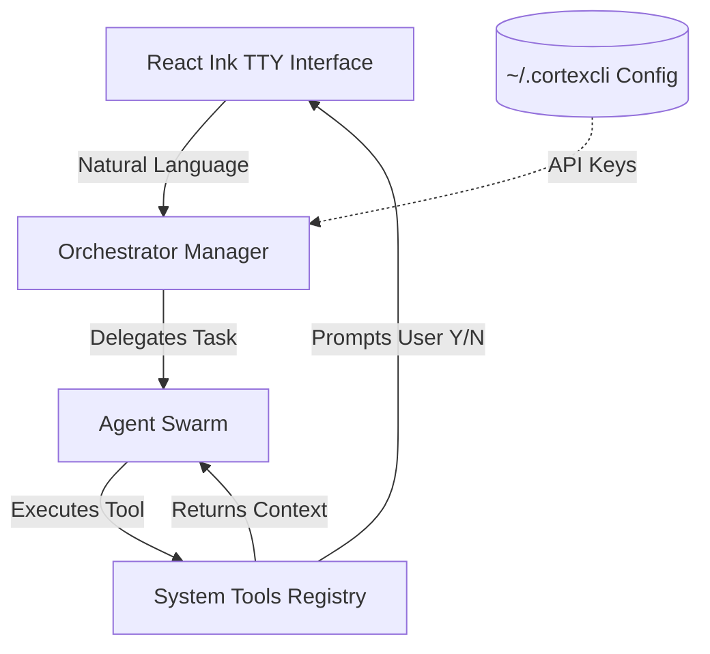

<div align="center">


# ⚡ CORTEX System v3.0

**Enterprise-Grade Multi-Agent OS & Shell Environment**

[](https://www.typescriptlang.org/)
[](https://nodejs.org/)
[](#)
[](#)

</div>

---

## 📑 Table of Contents
- [📖 Overview](#-overview)
- [🚀 Core Capabilities](#-core-capabilities)
- [🧩 Architecture](#-architecture)
- [🤖 The Agent Swarm](#-the-agent-swarm)
- [🛠️ Installation & Setup](#-installation--setup)
- [💻 Usage](#-usage)
- [🛡️ Security](#-security)
- [📄 License](#-license)

---

## 📖 Overview

**CORTEX** is an advanced, fully localized Multi-Agent Operating System built on Node.js and TypeScript. Designed to integrate natively into your command terminal, it replaces fragmented development workflows by providing an autonomous, zero-latency execution environment. 

Featuring a minimalist, high-performance React Ink `tty` interface, CORTEX decouples the **Body** (system permissions, tools, and UI) from the **Brain** (the LLM engine). This creates an unrestricted, model-agnostic execution vessel suited for enterprise development, system administration, and infrastructure automation.

---

## 🚀 Core Capabilities

- **Swappable Intelligence**: Agnostic proxy architecture allows you to route inference to any LLM. Use frontier models (OpenAI, Anthropic, Gemini) or private local models (LLaMa 3, Mistral) via LM Studio and Ollama.
- **Compiler-Level Security**: The AI operates in a Zero-Trust environment. Destructive commands and network payload executions trigger a physical thread block, requiring active human Y/N overrides.
- **Native OS Integration**: Instantly bootable from any directory. CORTEX commandeers its runtime environment for direct file manipulation and script execution.
- **Visual Perception**: Deep integration with Puppeteer and Vision arrays allows CORTEX to "see" web pages, capturing DOM data and screenshots autonomously.

---

## 🧩 Architecture

The orchestration engine routes natural language requests iteratively through a hierarchy of specialized agents:



---

## 🤖 The Agent Swarm

CORTEX utilizes a robust crew of specialized sub-agents to divide and conquer complex tasks:

| Agent | Responsibility | Sub-systems |
| :--- | :--- | :--- |
| **🔍 ExploreAgent** | Rapid filesystem indexing and structural analysis | Context mapping, Grep arrays |
| **📐 PlanAgent** | High-level system design and architectural mapping | Strategy definition, Goal tracking |
| **💻 DeveloperAgent** | Direct code authoring and application building | TS/React generators, AST parsers |
| **🧪 QualityAgent** | Rigorous testing, linting, and bug isolation | Jest integration, Error tracebacks |
| **🚀 DevOpsAgent** | Dependency management and infrastructure | Docker, NPM, CI/CD pipelines |
| **🌐 BrowserAgent** | Headless web navigation and data extraction | Puppeteer, DOM manipulation |

---

## 🛠️ Installation & Setup

Deploy CORTEX globally across your machine to initialize the system in any active workspace.

### 1. Prerequisites
Ensure you have the following installed:
- [Node.js](https://nodejs.org/) (v18.0.0 or higher)
- [Git](https://git-scm.com/)

### 2. Clone the Repository
```bash
git clone https://github.com/vimalspaceton618-afk/CORTEX.git
cd CORTEX
```

### 3. Install Dependencies
```bash
npm install
```

### 4. Build the Executable
Compile the TypeScript orchestrator and tools into the functional binary:
```bash
npm run build
```

### 5. Install Globally
Link the executable directly to your system path:
```bash
npm install -g .
# Alternatively, you can use: npm link
```

---

## 💻 Usage

Once the global installation is complete, CORTEX can be booted identically in any computer directory.

### Initialization
```bash
# Navigate to a target development project
cd /path/to/your/project

# Boot the terminal OS
cortex
```

### Natural Language Navigation
Once inside the interface, provide complex sequential tasks directly to the orchestrator:
> *"Map the internal routing of this Next.js project and optimize the API handlers."*

> *"Open the browser, crawl the latest React documentation, and summarize the new features."*

### Core Commands
| Command | Action |
| :--- | :--- |
| `/help` | Display interactive command and agent documentation |
| `/dashboard`| Toggle active telemetry and background processing views |
| `/exit` | Terminate the OS loop and clear the terminal |

---

## 🛡️ Security

**CORTEX is designed for enterprise integration.** We prevent API keys from leaking into version control by isolating configuration out of the repository completely.

Your credentials and system preferences are securely generated and locked at:
`~/.cortexcli/config.json`

If utilizing `.env` files internally for testing, ensure `.env` is listed within your `.gitignore`.

---

## 📄 License

**© 2026 SpaceTon.**  
This software is strictly **UNLICENSED** and proprietary. Any unauthorized copying, distribution, modification, or utilization of the CORTEX application source code is strictly prohibited. For inquiries regarding enterprise deployment, please refer to the internal documentation.
